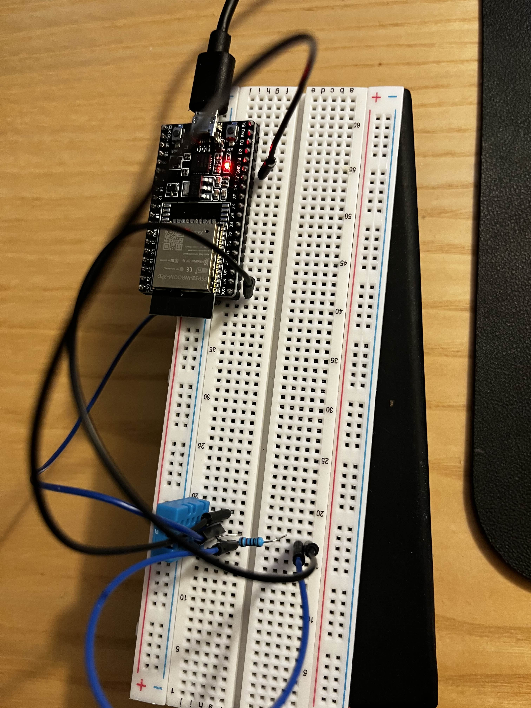
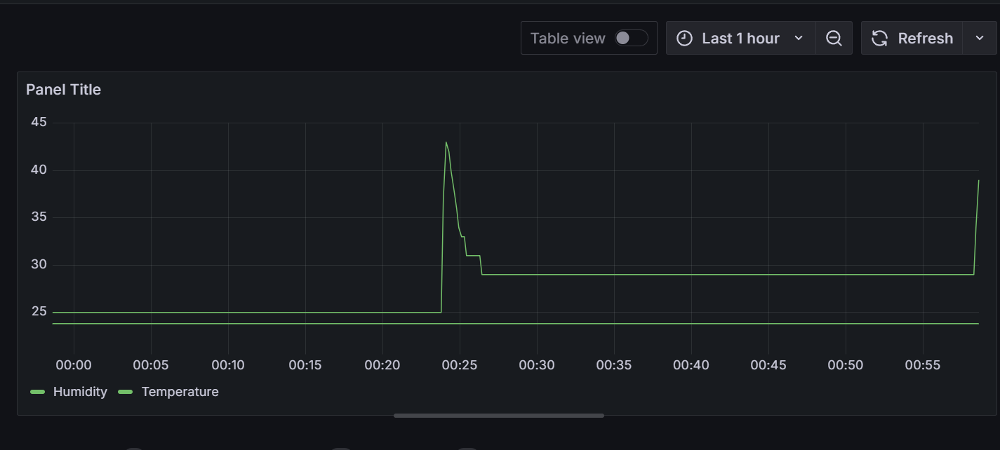
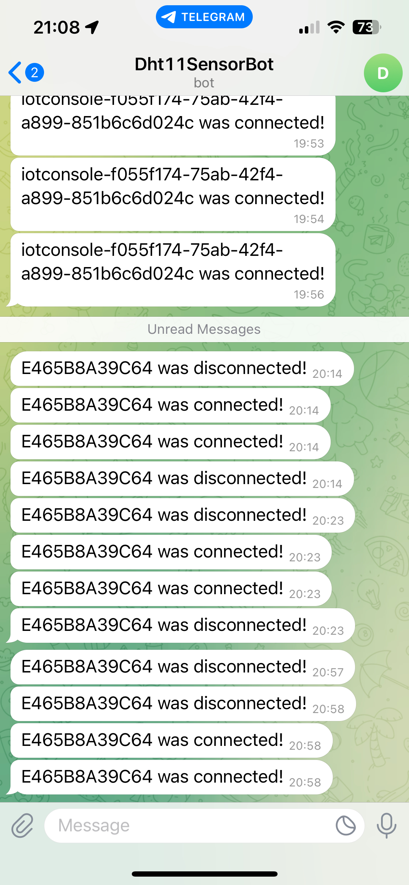
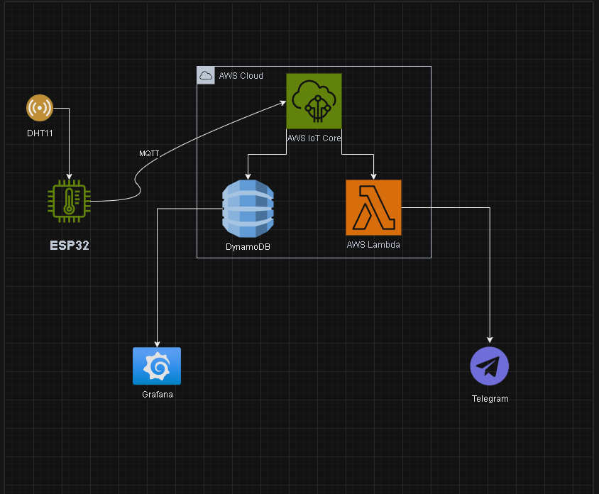

# IoT Väderövervakning med ESP32 och DHT11

## Innehållsförteckning
- [Introduktion](#introduktion)
- [Komponenter](#komponenter)
- [Intruktioner](#instruktioner)
- [Flödesschema](#flödesschema)
- [Säkerhet och Skalbarhet](#säkerhet-och-skalbarhet)
- [Slutsats](#slutsats)

---
## Introduktion
Detta projekt samlar in data från en DHT11-sensor via en ESP32-enhet. Sensordata (temperatur och luftfuktighet) skickas till AWS IoT Core för vidare hantering. Datan lagras i DynamoDB och visualiseras i realtid i Grafana. Vid statusändringar (ansluten/frånkopplad) skickas notifikationer via Telegram.

Projektet är designat för att möta behovet av realtidsövervakning av inomhusklimat, exempelvis i växthus, bostäder eller kontor. Fokus har lagts på säkerhet, tillgänglighet och enkel hantering av data. Systemet är skalbart och kan anpassas för fler sensorer eller integration med andra IoT-enheter.

--- 

## Komponenter

- **DHT11 Sensor**: Sensor för att mäta temperatur och luftfuktighet.
- **ESP32**: Mikrokontroller för att hantera sensordata och kommunicera med AWS IoT Core.
- **AWS IoT Core**: Hanterar anslutning och autentisering av enheter via MQTT.
- **DynamoDB**: Lagrar sensordata.
- **Grafana**: Visualiserar de insamlade data i realtid.
- **Telegram**: Skickar statusnotifikationer vid anslutning och frånkoppling av enheter.
- **AWS Lambda**: Processar statusändringar och skickar meddelanden till Telegram.

---

## 1. **Sensor (DHT11 & ESP32)**

- **Enhet:** DHT11 ansluten till ESP32.
- **Funktion:** Samlar in temperatur och luftfuktighetsdata och skickar den var 10:e sekund via MQTT.
<p align="center">
  
</p>

---

## 2. **Dataöverföring**

- **Protokoll:** MQTT (säker kommunikation via TLS).
- **Topic (Ämne):** `/telemetry`
- **Payload Format:**
    ```json
    {
      "temperature": 23.8,
      "humidity": 20.0
    }
    ```
- **Säkerhet:** Användning av X.509-certifikat för autentisering och TLS för säker dataöverföring.

---

## 3. **Molnhantering**

### **AWS IoT Core**
- **Autentisering:** X.509-certifikat för enhetsautentisering.
- **Regler:** 
  - **Datahantering:** Inkommande data vidarebefordras till DynamoDB för lagring.
  - **Status:** AWS IoT Core skickar statusuppdateringar till AWS Lambda (exempelvis enhetsstatus: ansluten/frånkopplad).

### **DynamoDB**
- **Syfte:** Lagring av sensordata för framtida analys.
- **Struktur:** 
  - Partition key: `deviceId`
  - Attribut: `timestamp`, `temperature`, `humidity`

---

## 4. **Visualisering**

- **Verktyg:** Grafana.
- **Datakälla:** DynamoDB.
- **Dashboard-funktioner:**
  - Real-time grafer för temperatur och luftfuktighet.
  - Uppdateras varje 10:e sekund för att visa aktuella mätvärden.
  

---

## 5. **Notifikationer via Telegram**

- **Tjänst:** Telegram.
- **Trigger:** AWS Lambda triggas vid förändringar i enhetens anslutning (ansluten eller frånkopplad).
- **Exempelmeddelande:** 
  - `"Enhet kopplades från!"`
- **Meddelandeformat:** Notifikationer skickas i realtid för att informera om enhetens statusändring.

<p align="center">
  
</p>

---

## **Instruktioner**

1. **Förbered DHT11-sensorn:**
   - Anslut DHT11-sensorn till **ESP32** enligt dokumentationen för din specifika sensor.
   - Se till att den är korrekt ansluten till en GPIO-port på ESP32, till exempel GPIO21.

2. **Koppla upp ESP32 till Wi-Fi:**
   - I koden, ersätt `WIFI_SSID` och `WIFI_PASSWORD` med dina egna Wi-Fi-uppgifter.
   - Se till att ESP32 har en stabil internetanslutning för att kommunicera med **AWS IoT Core**.

3. **Konfigurera AWS IoT Core:**
   - Skapa en **IoT-thing** i **AWS IoT Core**.
   - Hämta de nödvändiga certifikaten för autentisering (X.509-certifikat).
   - Lägg till certifikaten i din ESP32-kod för att säkerställa autentisering med AWS.

4. **Skicka data till AWS IoT Core:**
   - Använd **MQTT-protokollet** för att skicka sensorvärden (temperatur och luftfuktighet) till **AWS IoT Core**.
   - Se till att ESP32 publicerar data till rätt MQTT-ämne (`/telemetry`).

5. **Lagra data i DynamoDB:**
   - Konfigurera **DynamoDB** för att ta emot och lagra sensordata från **AWS IoT Core**.
   - Skapa tabeller för att lagra data baserat på unika enhets-ID:n och tidsstämplar.

6. **Visualisera data i Grafana:**
   - Konfigurera **Grafana** att hämta data från **DynamoDB**.
   - Skapa ett dashboard för att visa temperatur och luftfuktighet i realtid.

7. **Ställ in Telegram-notifikationer:**
   - Skapa en **AWS Lambda-funktion** för att skicka statusuppdateringar (ansluten/frånkopplad) när enheten ansluter eller kopplas från **AWS IoT Core**.
   - Anslut Lambda-funktionen till **Telegram Bot API** för att skicka meddelanden till användaren om enhetens status.

8. **Testa och övervaka projektet:**
   - Starta projektet och övervaka i **Grafana** för att se temperatur- och luftfuktighetsvärden.
   - Kontrollera att Telegram skickar notifieringar när enheten ansluter eller kopplas från.


---

## **Flödesschema**



## **Säkerhet och Skalbarhet**

- **Säkerhet**: Användning av **TLS-kryptering** och **X.509-certifikat** för säker kommunikation och autentisering.
- **Skalbarhet**: Systemet skalar automatiskt via **AWS IoT Core** och **DynamoDB**, vilket gör det enkelt att hantera fler enheter och data.

## **Slutsats**

Projektet demonstrerar en effektiv och säker lösning för att samla in, lagra och visualisera sensorinformation i realtid. Genom att använda AWS-tjänster och Grafana säkerställs både pålitlig datahantering och användarvänlig visualisering. Systemet är skalbart och kan enkelt anpassas för framtida utvidgningar.
